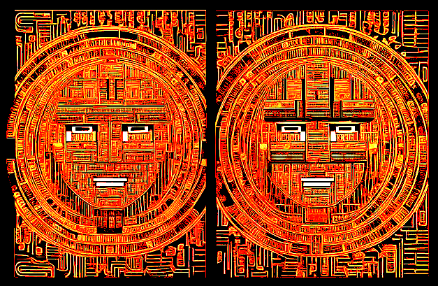

# The Lost Tribe of Mojibake
```
A d8rh8r adventure
```


The thing I love about this industry is that the seemingly innocuous can lead one down a truly awe inspiring road of discovery.  This is a tale of such a journey, the specifics removed to protect the identities involved and, add a lemon twist of mystery to the proceedings..  

Calling in a favour, I was powerless to refuse the request for a midnight conference call. Truth be told I would have attended favour or no. It's not often one hears the same enthusiasm reflected back about such niche topics, The conference call was the least I could do, and as is becoming the trend, our interaction didn't fail to deliver.

What I left the conversation with was an image of a snippet of some redacted logs and and questions exploding like a fork bombs inside my head.  This was going to be fun.  Taking a sample of the message I submitted it to an LLM to transcribe and translate.  Paydirt.  The LLM spat out some nice clean characters and an extremely tantalising chunklet of English.  In fact it gave the end of a conversation about a software issue which contained not only an address but a phone number.  Patting myself on the back,  as the self appointed new king of OSINT I decided to feed the LLM a larger piece of the puzzle.  Surprised is not the word I would use when I read the output:

**Translation:**

> Treatment of anorectal diseases by anorectal specialists. We diagnose and treat anorectal diseases such as hemorrhoids, anal fistulas, anal fissures, perianal abscesses, and anal stenosis.

**Note:**

- "肛門外科" translates to "anorectal surgery" or "proctology."
- "痔核" translates to "hemorrhoids."
- "痔瘻" translates to "anal fistula."
- "肛裂" translates to "anal fissure."
- "肛門周囲膿瘍" translates to "perianal abscess."
- "肛門狭窄" translates to "anal stenosis."

My curiosity was doing backflips as I casually abdicated the thrown.  Providing the snippet to a decent sample size of the most popular LLM deepened the mystery further with each response more bizarre than the one before.  I paused and waited for some b list celebrity to bust through the door and tell me I was being punk'd.  After more time than any sane person would have waited I resigned myself to the fact that this wasn't a prank and I was no closer to the solve.

If you're reading this, screaming at the solution at the screen, good for you.  It took me about an hour and more than a few orphaned sign ups to finally find an OCR that delivered the same output on every run.  What I was facing here, was a phenomenon I had never before encountered.

Mojibake (文字化け), literally "character transformation," is the term for garbled, unreadable text that arises when digital text is decoded using a character encoding different from the one used to encode it. It's apparently a common issue encountered when dealing with text in different languages and across various computer systems. 

"Yeah yeah Ryan, big deal, how does that relate to the bad bum clinic you mentioned above?"

Well, no pun intended but "Shit in, shit out" is a universal constant when it comes to LLMs.  To simplify the hell out of it, what we perceive as intelligence in these "AI" is just very fancy pattern recognition.  Answers are formed by linking the billions of little pattern pieces it has been trained on and formulating a response to your query.  Seems our little prompt was like digital DMT, with seemingly random characters from multiple languages, in a nonsensical order caused a 100% hallucination response.  Disabling memory and and submitting the prompt multiple time cemented this theory.

While all this was super cool and interesting I was still no closer to actual message.  A situation I quickly remedied with a little python.  [Warning the author of this article is about to go full nerd.  If you have a sensitivity to "tech jargon" please be advised and skip ahead a paragraph or two].  Taking the symbols I had been provided by the [Image to Text](https://www.onlineocr.net/) service on OnlineOCR I converted these to their hex values.   Well aware that this could be a fools errand, I checked the entropy of these values.   The value was low enough that I decide to write more code than get the sleep I sorely needed.

After a number of iterations I stumbled across a useful way to handle the errors and ultimately ended up with demojibakeme.py.  To be honest its a little hit and miss due to the fact that decoding from a mojibake string isn't the most reliable way to get the original bytecode and that the errors from that are compounded by the fact that some symbols in certain encoding standards are multibyte.  All that aside, ultimately I had a win.  A new digital discovery notch in this explorers belt and an unforgettable encounter with the strange phenomena of Mojibake.

I also decoded the snippet.... Naughty Naughty 
 
